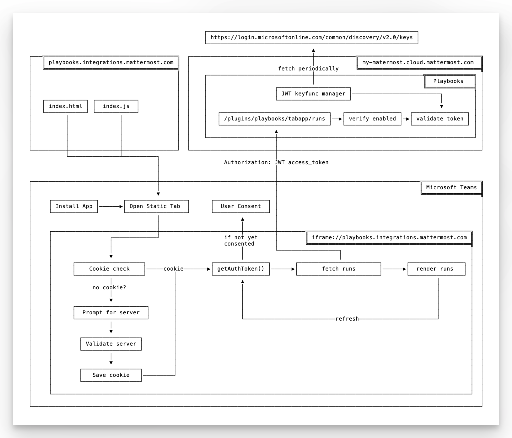
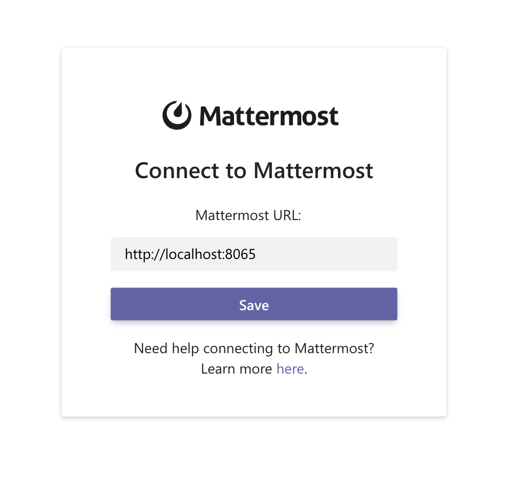

# Mattermost Playbooks for Teams

Mattermost Playbooks for Teams improves cross-organizational alignment and awareness by enabling access to your active Mattermost Playbook incidents and status updates directly in Microsoft Teams.

See the [Mattermost Product Documentation](https://mattermost.com/pl/ms-teams-plugin-end-user-learn-more) for details on installing, configuring, enabling, and using this Mattermost integration. If you are a developer who wants to work on this plugin, visit the [Development](#development) section on this page

## Features

- Securely expose read-only access to Playbook runs for users inside Teams without requiring a Mattermost account.
- Select which runs to expose by adding the `@msteams` bot as a Playbook run participant.
- Restrict access to authenticated sers in a configured Microsoft 365 tenant.

## License

This repository is licensed under the [Apache License v2.0](LICENSE).

## Development

This repository houses the single page application rendered inside Microsoft Teams. It works in tandem with [Mattermost Playbooks](https://github.com/mattermost/mattermost-plugin-playbooks), relying on cross-origin requests and [ID tokens](https://learn.microsoft.com/en-us/entra/identity-platform/id-tokens) to fetch and authenticate a user as from a particular Microsoft tenant.



### Setup

1. [Setup up your development environment](https://developers.mattermost.com/contribute/developer-setup/).
2. Install the [Mattermost Playbooks](https://github.com/mattermost/mattermost-plugin-playbooks) plugin.
3. Enable [developer mode](https://docs.mattermost.com/configure/developer-mode-configuration-settings.html#enable-developer-mode) to skip authentication and develop outside Microsoft Teams.
4. Install NPM dependencies in this repository using `npm install`.
5. Run this application in development mode using `npm run start`.

This final step should open a webpack dev server, at which point you can connect to your instance on `https://localhost:8065`:



With developer mode and running outside Microsoft Teams, the normal authentication steps are skipped. For a more comprehensive development environment, proceed to setting up insiding Microsoft Teams.

### Setup (inside Microsoft Teams)

To fully test and develop inside the Microsoft Teams environment, it's necessary to provision and install a Microsoft Teams app. 

1. Install the [Teams toolkit CLI](https://learn.microsoft.com/en-us/microsoftteams/platform/toolkit/teams-toolkit-cli): `npm install -g @microsoft/teamsapp-cli`.
2. Provision the app: `teamsapp provision --env dev`.
3. Modify the `TAB_ENDPOINT` and `TAB_DOMAIN` variables in [env/.env.dev](env/.env.dev) to point at your machine, e.g. exposed via an [Ngrok](https://ngrok.com/) tunnel. If you use an alternate tunnelling solution, you'll need to update [webpack.config.ts](./webpack.config.ts) to allow the corresponding host.

```diff
-TAB_ENDPOINT=https://playbooks.integrations.mattermost.com/
-TAB_DOMAIN=playbooks.integrations.mattermost.com
+TAB_ENDPOINT=https://my-custom-host.ngrok.io/
+TAB_DOMAIN=my-custom-host.ngrok.io
```
4. Run `teamsapp preview --env dev` to load Teams pointing at your locally hosted version of the app.
5. When prompted, click `Add` to temporarily add the application.

This final step should load your webpack dev server inside the context of Teams, at which point you can connect to your instance on `https://localhost:8065` with authentication enabled, allowing you to optionally disable developer mode.
